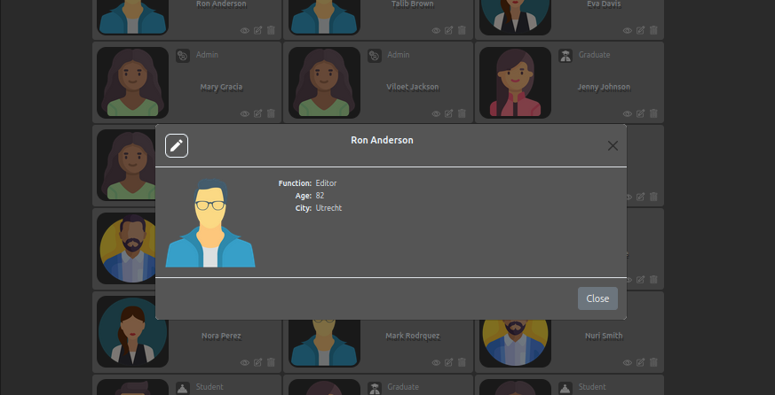

# Introduction

This my demo front end application, which I have made by ReactJS.

With this app you can manage users, by sorting, adding, editing and deleting them.
There is no API, so no changes are saved on the server. This app uses the browser cookies to
save the updates of a user.

# Code

This application is made with ReactJs, Javascript, HTML and CSS.
The file structure follows the standard  ReactJs structure.
My addition is the folder 'lib' where I have put some Javascript classes.

Important files and folders  :
   
| File/folder |  | 
| :--- | :--- | 
| src/App.jsx | The routing configuration  |
| src/assets | Assets as in standard React, now including some images |
| src/components | React components including the styles in separate files. The components might have sub components in sub folders of the component. |
| src/components/Helpers | Some components, which are used by several components |
| src/lib | Some Javascript classes. Because this application has no API it has some classes and functions, which normally would be in the API. |
| src/pages | The components for the pages on this applicatoion, 'home' and 'demo', these are usigng the components in the folder  src/components  |
| src/pages/Layout/Layout.jsx | The main layout  |

# Demo

Below there are some screenshots\
\
\
Home\
\

\
\
Home responsive\
\

\
\
Index\
\

\
\
Index responsive\

\
\
Details\
\

\
\
Edit form\

